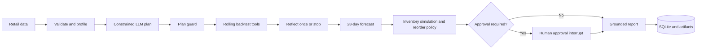

# StockWise

StockWise is an agentic retail demand forecasting and replenishment decision system. It combines deterministic forecasting and inventory tools with a constrained LangGraph workflow, human approval, persistent execution state, and a FastAPI + Streamlit product demo.

The project is designed as a portfolio-quality Agent Engineering case study. It is not a chat interface: the Agent validates data, plans an allow-listed experiment, executes rolling backtests, selects a model, produces a 28-day forecast, calculates replenishment decisions, pauses for human approval, and writes a grounded report.

> Inventory, lead-time, and cost inputs are simulated with a fixed seed. M5 sales, price, and calendar data remain real upstream data when the M5 workflow is used.

## Architecture



See [docs/architecture.md](docs/architecture.md) for system boundaries and safety decisions.

## Features

- Canonical CSV upload and M5 subset preparation with Polars and Parquet.
- Seasonal Naive, Croston SBA, and global LightGBM forecast tools.
- Rolling-origin evaluation with WMAPE, MAE, MASE, interval coverage, and explicit fallback logs.
- Deterministic safety stock, reorder point, order quantity, cost, and fill-rate calculations.
- LangGraph state, SQLite checkpointing, one-step reflection, and human interrupt/resume.
- OpenAI-compatible LLM adapter with Pydantic validation, retry, numeric grounding, and mock mode.
- FastAPI endpoints, automatic OpenAPI documentation, Streamlit dashboard, HTML/JSON/CSV reports.
- Reproducible synthetic fixtures, unit tests, API lifecycle tests, Docker configuration, and CI.

## Quick start

Requirements: Miniconda, Git, and approximately 2 GB free space for the development environment. The recommended local environment is `D:\software\miniconda3\envs\stockwise-agent` with Python 3.12.

```powershell
conda env create -f environment.yml
conda activate stockwise-agent
Copy-Item .env.example .env
python -m pytest
stockwise run-demo --items 8
```

Start the API and UI in two terminals:

```powershell
stockwise serve-api
$env:STOCKWISE_API_URL="http://127.0.0.1:8000/api/v1"
streamlit run ui/app.py
```

- API docs: <http://127.0.0.1:8000/docs>
- Streamlit: <http://127.0.0.1:8501>

The default `LLM_MODE=mock` needs no API key. For a live OpenAI-compatible endpoint:

```dotenv
LLM_MODE=api
LLM_BASE_URL=https://api.openai.com/v1
LLM_API_KEY=replace-me
LLM_MODEL=gpt-4.1-mini
```

Secrets are never stored in SQLite or logs.

## Canonical data schema

Uploaded CSV files must contain:

| Column | Meaning |
| --- | --- |
| `date` | Daily observation date |
| `store_id` | Store identifier |
| `item_id` | Product identifier |
| `sales` | Non-negative unit sales |
| `sell_price` | Unit selling price |
| `promo_flag` | Boolean promotion indicator |
| `event_name` | Event name or an empty string |

## M5 workflow

Review the upstream M5 terms before downloading. Data files are kept under ignored directories and are never redistributed by this repository.

```powershell
stockwise download-m5 --accept-source-terms
stockwise prepare-m5 --source-dir data/raw/m5 --items 30
```

For the portfolio evaluation, use `--items 100`. The importer selects `CA_1`, `TX_1`, and `WI_1` by default and creates a compressed Parquet subset.

## API

- `GET /api/v1/health`
- `POST /api/v1/datasets`
- `GET /api/v1/datasets`
- `POST /api/v1/runs`
- `GET /api/v1/runs/{run_id}`
- `GET /api/v1/runs/{run_id}/events`
- `GET /api/v1/runs/{run_id}/results`
- `POST /api/v1/runs/{run_id}/approval`
- `GET /api/v1/runs/{run_id}/report`

## Evaluation policy

Forecast metrics and resume claims must come from a reproducible run. The repository intentionally contains no pre-filled performance claims. The generated result records include:

- WMAPE, MAE, MASE, interval coverage, and improvement over Seasonal Naive.
- Agent fallback usage and approval rate.
- Projected fill rate, order value, holding cost, and stockout cost under simulated inventory inputs.

See [docs/resume-template.md](docs/resume-template.md) for wording that must only be completed after evaluation.

## Deployment

Local execution is the acceptance target. Container definitions are included for portable deployment:

```bash
docker compose up --build
```

The API and UI are separate services. Mount persistent volumes for SQLite, checkpoints, data, and artifacts in any hosted deployment.

## Development

```powershell
ruff check .
python -m pytest --cov=stockwise
```

Licensed under the MIT License. M5 data remains subject to its upstream terms.
