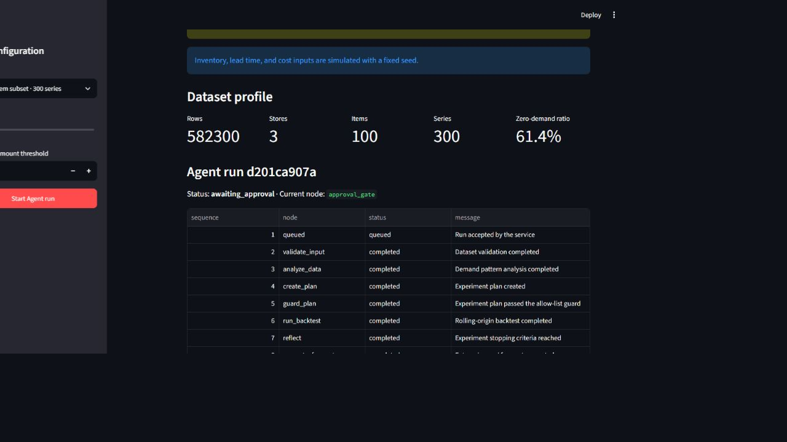
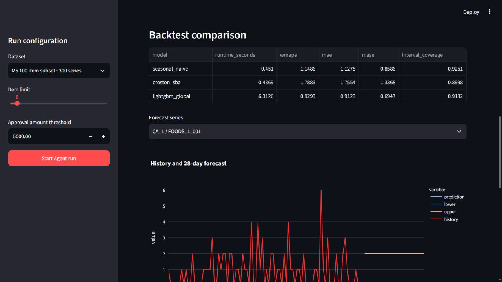
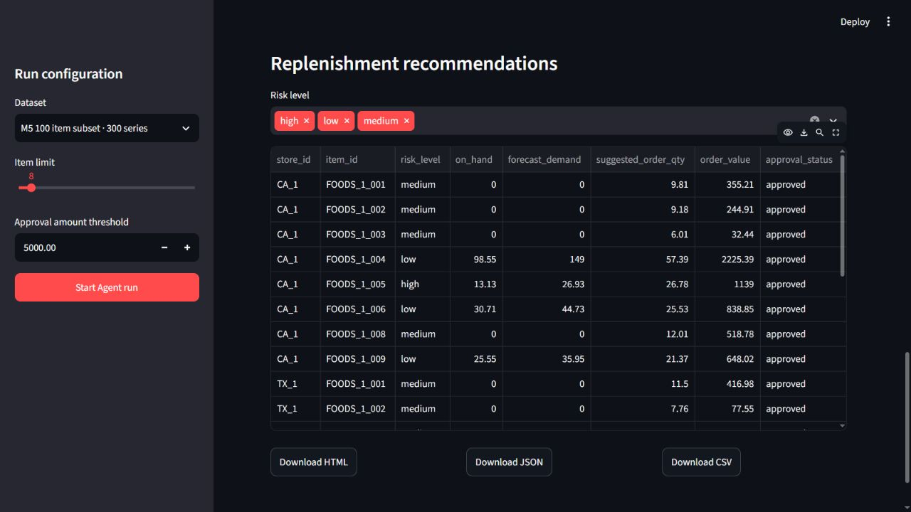

# StockWise 中文说明

StockWise 是一个面向零售需求预测与补货决策的 Agent 工程项目。系统不是聊天机器人，而是通过 LangGraph 编排数据校验、实验规划、模型回测、需求预测、库存计算、人工审批和报告生成。

## 产品演示

下列界面使用已处理的 M5 数据子集和 mock LLM 模式运行。预测指标由确定性评估工具计算；库存、提前期与成本为固定随机种子的模拟数据。

**Agent 执行轨迹与人工审批中断**



**模型回测与未来 28 天预测**



**审批后的补货建议与报告导出**



## 项目亮点

- 使用 Seasonal Naive、Croston SBA 和 Global LightGBM 进行滚动回测与模型比较。
- 对间歇性 SKU 使用固定的一件/天预测死区，避免不足一件的微小预测累积成虚假需求。
- 大模型只负责受约束的实验规划和文字解释，所有数值计算均由确定性工具完成。
- 对无效计划进行 Pydantic 校验和模型白名单拦截。
- 对低置信度、高金额和异常数据场景触发人工审批。
- 使用 SQLite 保存业务记录，使用 LangGraph SQLite checkpointer 恢复中断工作流。
- 提供 FastAPI、Streamlit、HTML/JSON/CSV 报告、测试与容器配置。

## 本地运行

```powershell
conda env create -f environment.yml
conda activate stockwise-agent
Copy-Item .env.example .env
python -m pytest
stockwise run-demo --items 8
```

环境文件会创建独立的 Python 3.12 `stockwise-agent` Conda 环境，项目目录中无需创建 `.venv`。

分别启动后端与界面：

```powershell
stockwise serve-api
$env:STOCKWISE_API_URL="http://127.0.0.1:8000/api/v1"
streamlit run ui/app.py
```

默认使用无需 API Key 的 mock 模式。需要真实模型时，在 `.env` 中填写兼容 OpenAI API 的地址、密钥和模型名称。

## 数据说明

M5 工作流使用真实销量、价格和日历数据。库存、采购提前期和成本没有伪装成真实企业数据，而是使用固定随机种子生成并在界面与报告中标注为模拟数据。原始数据、中间文件、数据库、模型文件和报告均不会提交 Git。

完成 M5 子集转换后，可运行真实销量数据评估：

```powershell
stockwise evaluate-m5 --items 30 --runs 3
```

正式作品集评估使用 `--items 100`。M5 与合成数据报告使用不同文件名，不会互相覆盖。

项目的架构、安全约束和简历描述模板分别位于 `docs/architecture.md` 与 `docs/resume-template.md`。

真实 M5 销量评估方法与结果记录在 `docs/benchmark.md`；其中库存结果仍来自固定随机种子的模拟场景。
